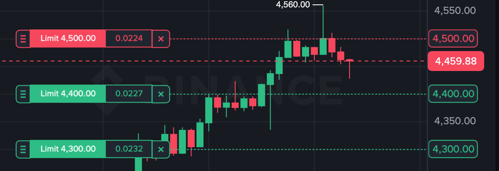

# Grid Trading Bot

Automated cryptocurrency trading bot that profits from market volatility by buying low and selling high at predefined price levels.

## What is Grid Trading?

Grid trading splits a price range into levels. The bot automatically buys when price drops to each level, then sells when price rises.

**Example**: ETH grid from $4000-$4500 with $100 steps
- Buy at $4000 → Sell at $4100
- Buy at $4100 → Sell at $4200
- Buy at $4200 → Sell at $4300
- And so on...



Each level operates independently, capturing profits as price moves up and down within the range.

👉 More: **[IDEA.md](docs/IDEA.md)** - Strategy concept


## Setup

### Prerequisites

- Server with Linux and fixed IP address (to whitelist in Binance)
- Docker & Docker Compose
- USDT in Binance Spot account

### Clone the project

```
git clone git@github.com:asidko/grid-trading-bot.git
cd grid-trading-bot
```

### Initialize Configuration

```bash
make init
```

Edit `.env` with your Binance API credentials:
- `BINANCE_API_KEY` - Your API key (required)
- `BINANCE_API_SECRET` - Your API secret (required)
- Link: https://www.binance.com/en/my/settings/api-management. Make sure to enable Spot Trading permissions (you have also provide your IP to allow this option).

### Start Services

```bash
make up
```

Services run on localhost:
- Grid Trading: 8080
- Order Assurance: 9090
- Price Monitor: 7070

### Calculate Profit

Before creating levels, estimate your profit:

```bash
# Just a calculator, bot won't do any actions here
make calc
```

Example:
```
Buy price: 3500
Sell price: 3700
Buy amount USDT: 1000

Step: 200 | Profit: 55.23 USDT (5.52%)
```

### Create Grid Levels

```bash
make levels
```

Interactive prompts will guide you through setup. Example grid:
- Symbol: ETHUSDT
- Min price: 3500
- Max price: 4500
- Grid step: 200
- Buy amount: 1000 USDT

This creates 5 levels at: 3500, 3700, 3900, 4100, 4300

### Check Status

```bash
make status
```

Shows your trading performance:
```
📊 Activity: 5 buys, 3 sells, 0 errors
💰 Profit: 12.45 today | 78.90 week | 234.56 month | 1024.78 total (USDT)
📈 Levels: 8 holding, 12 ready

🟢 Last Buy: ETHUSDT @ 4100
   Amount: 0.122 | Time: 2025-09-30T09:15:23Z

🔴 Last Sell: ETHUSDT @ 4200
   Profit: 4.85 USDT (0.97%) | Time: 2025-09-30T11:42:10Z

📍 Price: ETHUSDT @ 4158.35 | 2025-09-30T12:30:45Z
```

### Monitor

```bash
# View logs
make logs

# Stop services
make stop
```

### Cleanup

```bash
# Stop and remove containers
make down

# Remove database data (⚠️ all data lost)
rm -rf .grid-trading-data
```   

### Other tips

#### Check what levels are active right now

Check levels with any status other than "ready" (to get levels where we're waiting for buy or sell at the moment):

```bash
sqlite3 -header -column .grid-trading-data/grid_trading.db "SELECT buy_price, sell_price, buy_amount, filled_amount, state, updated_at FROM grid_levels WHERE state <> 'READY';"
```

#### Check last transactions

```bash
# Select any last transactions
sqlite3 -header -column .grid-trading-data/grid_trading.db "SELECT created_at, symbol, side, status, target_price, amount_usdt, profit_usdt FROM transactions ORDER BY created_at DESC LIMIT 10;"
```

```bash
# Select last sell transactions
sqlite3 -header -column .grid-trading-data/grid_trading.db "SELECT s.created_at, s.symbol, b.target_price as buy_price, s.target_price as sell_price, s.amount_usdt, s.profit_usdt FROM transactions as s JOIN transactions as b ON b.id = s.related_buy_id  WHERE s.side='SELL' and s.
status='FILLED' ORDER BY s.created_at DESC LIMIT 10;"
```

#### I changed my mind and want to use other levels or symbol

1. Delete all levels from database:

```bash
# Delete all levels from grid_levels table - the bot won't be able to trade anymore
sudo sqlite3 .grid-trading-data/grid_trading.db "DELETE FROM grid_levels;"

# (optionally) Delete all transactions from transactions table to clear the trading history
sudo sqlite3 .grid-trading-data/grid_trading.db "DELETE FROM transactions;"
```

2. Go to Binance Spot and cancel all active orders for the symbol (‼️ you may want to leave the last sell order to sell what you have bought).

3. To create new levels:

```bash
# Run levels creation again
make levels
```